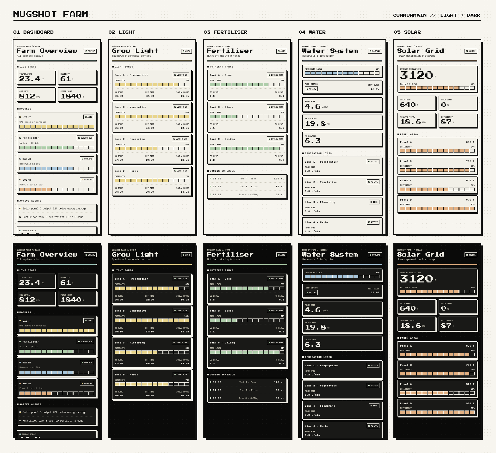
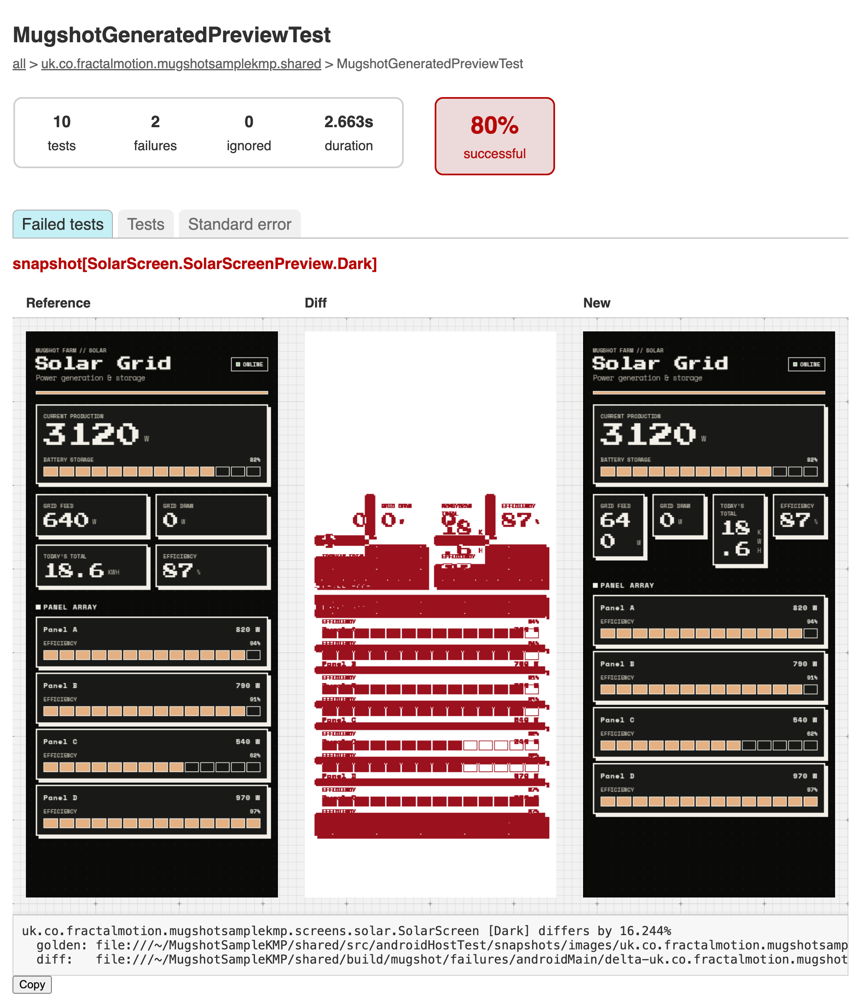
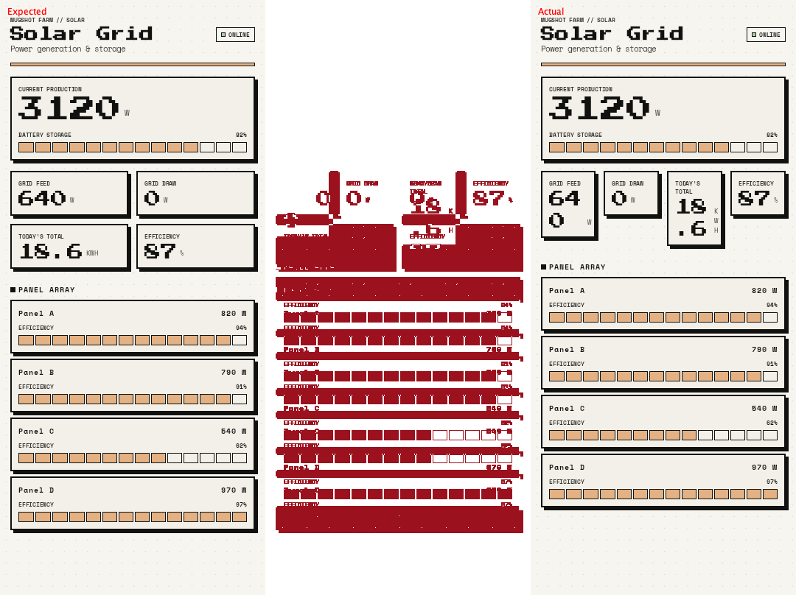

# Mugshot Farm

[](https://central.sonatype.com/artifact/uk.co.fractalmotion.mugshot/mugshot)


A small Compose Multiplatform app that shows what screenshot testing looks like in a real
KMP project with [Mugshot](https://github.com/TRazDev/Mugshot).

It has five screens written once in `commonMain`, runs on Android, iOS and Desktop, and has
twelve golden images that Mugshot renders on the JVM. You don't need an emulator, a simulator,
or a single hand-written test class.



<sub>Every screen above is an unedited golden image produced by `recordMugshot`.</sub>

---

## The app

Mugshot Farm is a pretend control panel for an indoor farm. It isn't wired to anything. Every
screen reads static mock data, so the UI is the only part worth looking at, and the UI is
what gets tested.

| Screen | What it shows |
| --- | --- |
| **Dashboard** | Live stats, a status card per module, active alerts |
| **Grow Light** | Lighting zones with intensity gauges and on/off schedules |
| **Fertiliser** | Nutrient tank levels, EC/pH, the dosing schedule |
| **Water** | Reservoir, pump, flow rate, irrigation lines |
| **Solar** | Production, battery, grid feed/draw, per-panel efficiency |

The screens are deliberately ordinary Compose Multiplatform code, the kind you already have:

- **One UI, three platforms.** Everything lives in [`shared/src/commonMain`](shared/src/commonMain/kotlin/uk/co/fractalmotion/mugshotsamplekmp).
  [`androidApp`](androidApp), [`iosApp`](iosApp) and [`desktopApp`](desktopApp) are thin entry points that call `App()`.
- **Compose resources.** Strings and fonts go through `Res` and `stringResource`, with
  English, Italian and Japanese translations.
- **Light and dark themes** from a single token set in [`theme/`](shared/src/commonMain/kotlin/uk/co/fractalmotion/mugshotsamplekmp/theme).
- **Responsive layouts.** Stat grids switch from 2 to 4 columns on wide windows.
- **`@PreviewParameter`.** The Grow Light screen previews both a healthy state and one with a
  faulty zone.

```
shared/src/
├── commonMain/                 # every screen, component and theme token
│   ├── kotlin/.../screens/     # dashboard, light, fertiliser, water, solar
│   └── composeResources/       # strings (en, it, ja) and pixel fonts
└── androidHostTest/snapshots/  # the golden images Mugshot records
```

## Adding Mugshot to a KMP project

The entire integration is [one commit](https://github.com/TRazDev/MugshotSampleKMP/commit/d6d869e).
It's about ten lines of Gradle, plus two annotations on each preview you want tested.

**1. Add the plugins to the version catalog** ([`gradle/libs.versions.toml`](gradle/libs.versions.toml))

```toml
[versions]
ksp = "2.3.8"
mugshot = "3.4.1"

[plugins]
ksp = { id = "com.google.devtools.ksp", version.ref = "ksp" }
mugshot = { id = "uk.co.fractalmotion.mugshot", version.ref = "mugshot" }
```

**2. Declare Mugshot in the root build** ([`build.gradle.kts`](build.gradle.kts))

```kotlin
plugins {
    // ...
    alias(libs.plugins.mugshot) apply false
}
```

**3. Apply it to the shared module and turn on host tests** ([`shared/build.gradle.kts`](shared/build.gradle.kts))

```kotlin
plugins {
    alias(libs.plugins.kotlinMultiplatform)
    alias(libs.plugins.androidMultiplatformLibrary)
    // ...
    alias(libs.plugins.ksp)
    alias(libs.plugins.mugshot)
}

kotlin {
    android {
        // ...
        withHostTest {
            isIncludeAndroidResources = true
        }
    }
}
```

`withHostTest` matters. The Android KMP library plugin doesn't create a host test
compilation by default, and that compilation is where Mugshot generates and runs its tests.

That's all the Gradle there is. You don't add any dependencies: the plugin puts the annotations
and runtime on `commonMain`, and the test machinery on `androidHostTest`.

**4. Annotate the previews you already have**

```kotlin
@Mugshot
@MugshotLightDark
@Preview
@Composable
internal fun SolarScreenPreview() {
    MugshotAppTheme { SolarScreen(state = MockSolarData.default) }
}
```

This is a plain `@Preview` in `commonMain`. The only change besides the two annotations was
`private` → `internal`, because the generated test has to be able to call the function.

**5. Record**

```bash
./gradlew :shared:recordMugshot
```

Mugshot finds every `@Mugshot` preview, generates a test that renders each one, and writes the
results to `shared/src/androidHostTest/snapshots/images/`. You commit those images. From then
on, this fails the build whenever a screen changes:

```bash
./gradlew :shared:verifyMugshot
```

### What gets recorded

Five annotated previews become twelve images:

| Preview | Axes | Images |
| --- | --- | --- |
| `DashboardScreenPreview` | light, dark | 2 |
| `LightScreenPreview` | light, dark × 2 `@PreviewParameter` states | 4 |
| `FertiliserScreenPreview` | light, dark | 2 |
| `WaterScreenPreview` | light, dark | 2 |
| `SolarScreenPreview` | light, dark | 2 |

Axes multiply. If you swap `@MugshotLightDark` for `@MugshotMatrix`, each preview gets rendered
across phone, foldable, tablet and landscape, in light and dark, at three font scales, with no
other changes. The full list of annotations is in the
[Mugshot README](https://github.com/TRazDev/Mugshot#annotations).

## When something breaks

Here's a regression that's easy to ship. Someone flips the condition that picks the column count
on the Solar screen:

```diff
- columns = if (windowSize == FarmWindowSize.Compact) 2 else 4,
+ columns = if (windowSize != FarmWindowSize.Compact) 2 else 4,
```

It compiles, and it looks fine on a desktop window. On a phone, four stat tiles get squeezed
into one row and the numbers wrap. `verifyMugshot` catches it:

```
MugshotGeneratedPreviewTest > snapshot[SolarScreen.SolarScreenPreview.Light] FAILED
MugshotGeneratedPreviewTest > snapshot[SolarScreen.SolarScreenPreview.Dark] FAILED

10 tests completed, 2 failed
```

The HTML report shows the golden, a diff, and the new render next to each other:



In the diff, red marks every pixel that changed, and everything else is blank. It's
immediately clear the problem is the stat grid and everything below it, not the header.

<details>
<summary>The same failure as a single image, for CI</summary>
<br>

Mugshot also writes the golden, diff and actual render as one combined image to
`shared/build/mugshot/failures/`. The console error links to it, and a CI job can upload it
as an artifact.



</details>

To make CI fail on visual regressions, hook verification into `check`:

```kotlin
// shared/build.gradle.kts
tasks.named("check") {
    dependsOn("verifyMugshot")
}
```

If the change was intentional, run `recordMugshot` again and commit the new goldens along
with the code.

## Good to know

- **Use Mugshot 3.4.1 or newer.** Support for KMP modules and `commonMain` previews arrived in
  3.4.0, and 3.4.1 fixes that release's publishing.
- **`stringResource` works in previews.** Mugshot sets up Compose resources before each render,
  so localised strings show up in goldens without any extra setup.
- **Previews can't be `private`.** A private `@Mugshot` preview is silently skipped. Add
  `uk.co.fractalmotion.mugshot:mugshot-preview-lints` as a lint check to get an error instead.
- **`@Preview` arguments are ignored.** Set device, theme, locale and font scale with Mugshot's
  annotations, not `@Preview(uiMode = ...)`. Otherwise the IDE preview and the golden drift
  apart.
- **Mugshot and Robolectric can't share a module.** Keep Robolectric tests in a different
  module.

## Running the app

- **Android:** `./gradlew :androidApp:assembleDebug`, or use the run configuration in Android Studio
- **Desktop:** `./gradlew :desktopApp:run`, or `./gradlew :desktopApp:hotRun --auto` for hot reload
- **iOS:** open [`iosApp`](iosApp) in Xcode and run it

## Learn more

- [Mugshot](https://github.com/TRazDev/Mugshot): the library, full annotation reference and configuration
- [Changelog](https://github.com/TRazDev/Mugshot/blob/main/CHANGELOG.md)
- [Limitations](https://github.com/TRazDev/Mugshot/blob/main/LIMITATIONS.md): what Mugshot doesn't do, and where its rendering differs from a device
